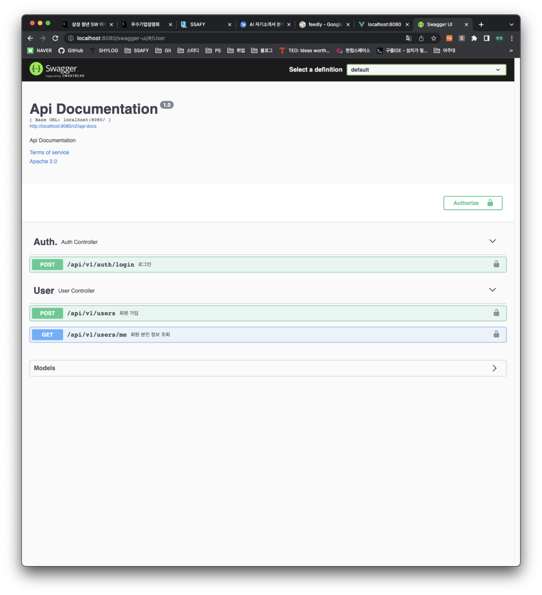
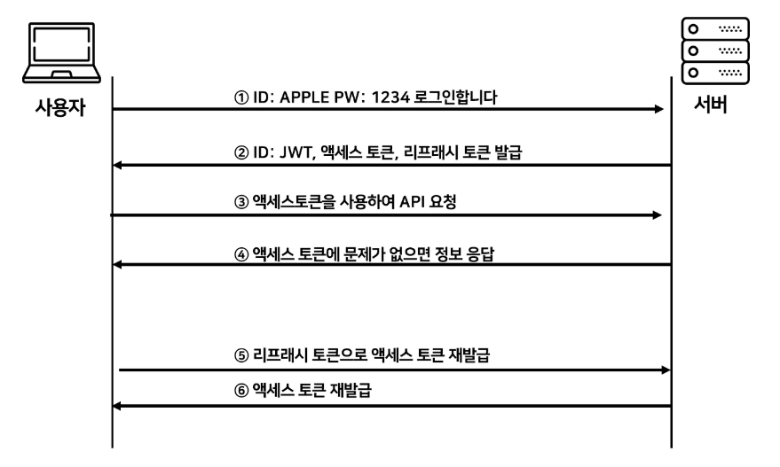

# 소현영

## 활동 일지

### 7/11

- 오프라인 첫날
- 아이디어 회의 -> 추가 아이디에이션 필요
- 수업 후 치맥

### 7/12

- 팀 빌딩 활동
- 아이디어 확정 - 낭만버스

### 7/13

- 면접
- 낭만버스 아이디어 교수님 컨펌 완료
- 낭만버스 추가 아이디어 회의 진행

### 7/14

- 낭만버스 추가 아이디어 회의 진행 (데이터 중심)
- 낭만버스 1차 핵심 구현 기능 선정

### 7/15

- 낭만버스 유저 플로우 작성
- 개인 과제 진행 및 개발 환경 세팅

### 7/16

- 개인 과제 진행
- JWT 관련 내용 학습

### 7/17

- 낭만버스 와이어프레임 작성
- 서비스 기획 관련 학습

## 구현 내용

### Back

### Front

## 학습 내용

### 서비스 기획

#### IA

- IA (Information Architecture)
- 서비스의 목차
- 개발 페이지 목록의 역할
- 보통 트리 구조나 엑셀로 작성
- 모바일에서는 계층형, 허브 앤 스포크, 선형, 탭 패턴이 자주 사용

#### WireFrame

- 화면에 대한 청사진
- 화면의 구조, 콘텐츠, 기능 등이 표시
- IA에서 설계한 서비스의 구조와 각 화면별 정보를 바탕으로 작업

#### StoryBoard

- 서비스 설계의 최종적인 산출물
- 정책, 프로세스, 콘텐츠 구성, 와이어프레임, 기능 정의 등을 표시

#### 참고

- https://plavement.tistory.com/52
- https://plavement.tistory.com/27
- https://plavement.tistory.com/55
- https://plavement.tistory.com/34

### JWT

- Json Web Token
- 인증에 필요한 정보를 암호화시킨 JSON 토큰
- JWT 토큰을 HTTP 헤더에 실어 요청하면 서버가 클라이언트 식별
- Base64 URL -safe Encode를 통해 인코딩

#### JWT 구조

- . 을 구분자로 하는 3가지 문자열의 조합
- `Header.Payload.Signature`
- Header
    - JWT에서 사용할 타입
    - 해시 알고리즘의 종류
- Payload
    - 사용자 권한 정보와 데이터
- Signature
    - 개인키로 서명한 전자서명

#### JWT 인증 과정

#### 참고

- https://inpa.tistory.com/entry/WEB-📚-JWTjson-web-token-란-💯-정리#JWT를_이용한_인증_과정
