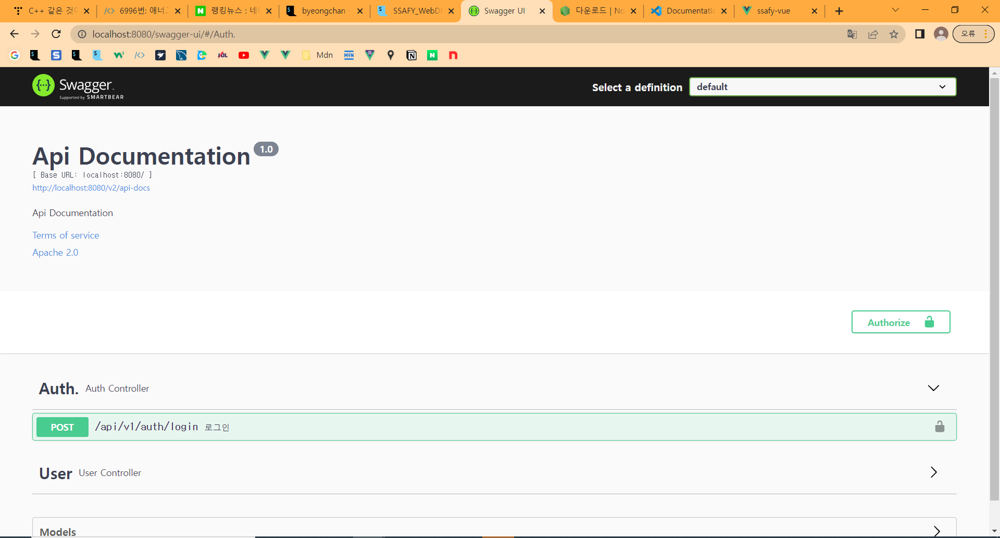
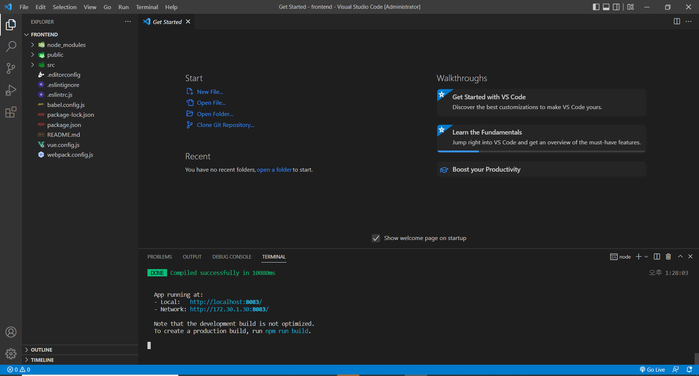
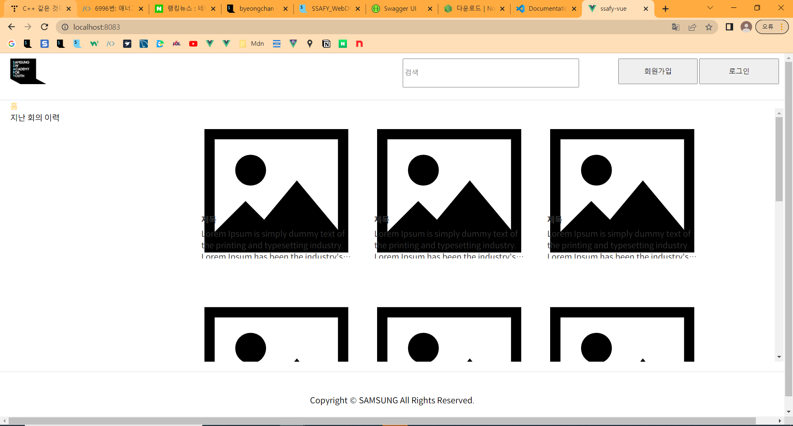
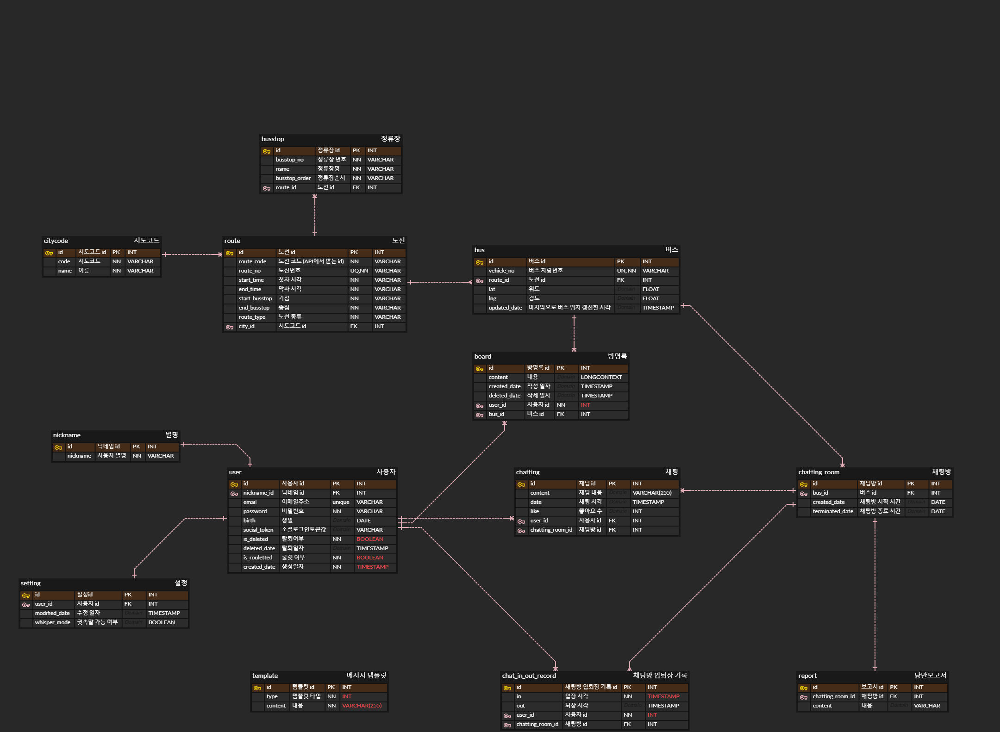

### 1순위

- 승하차 감지 (아마 GPS)
    - gps
        - 승차시, 여러 버스가 겹친다면, 선택 가능하도록
    - 버스 차량번호
- 그룹 채팅 기능
    - 실시간 유저 목록
    - 아이디 옆에 목적지(필수는 아님)
    - 상태(스터이터스) 표시 → 자는중, 게임중, 온라인, 피곤함, 출근(퇴근)중, 술마려움, 우울함
    - ~~깨워주세요 → 웹이라 기능적으로는 힘듬, 본인이 본인을 특정해야함~~
    - 입장 시, 스몰토크 주제 제시 및 대답이 본인 입장 멘트로 쓰임
- 1:1채팅(DM) → ~~막고라 신청~~
    - 쪽지도 좋음ㅋ
- 1:1화상채팅(RTC) → 가성비떨어지는 기능 중 하나
    - RTC → 음성 및 영상 실시간 통신
    - [https://medium.com/@hyun.sang/webrtc-webrtc란-43df68cbe511](https://medium.com/@hyun.sang/webrtc-webrtc%EB%9E%80-43df68cbe511)
    
    
    
- 친구추가 및 벤
    - 벤 당한 횟수(신고)
    - ㄵ
- 로그인
- 프로필(리얼미/가우르구라)
- 우수사용자 특전 및 나쁜사용자 벌칙
    - 우수
        - 투명채팅 기능
    - 나쁜
        - 신고당한 횟수에 비례해서, 채팅과 아이디가 흐려짐ㅋㅋ
- 버스 별 게시판 → 수도권 광역버스

### 2순위

- 사진/동영상 첨부
- 이모티콘 등록 및 채팅
- 슈퍼 계정
    - 모든 채팅방 입장 가능 및 유저 영구 벤 가능
- 인터넷 검색(#)
- 미니게임 → 자리걸고 ㅋㅋ → 큰 문제

### 0714

- 기획 아이디어 회의

### 0715

- Sub 1 개인과제
- 이클립스, MySQL로 환경설정 백엔드 해봤는데 
- QUser 에러 발생 해결하거나 IntelliJ로 변경할 예정

### 0717

### 0718
- Sub 1 종료
- Sub 2 시작
- GitLab, Jira 이동 완료
- 와이어프레임, 기술 명세서 작성
- 밀접 접촉자 판정으로 자가격리 시작ㅠㅠ...

필요한 페이지

- 로그인(온보딩)
    - 로그인 - 아이디(이메일)와 비밀번호로 로그인
    - 로그아웃 - 로그아웃
    - 비밀번호 찾기 - 해당 이메일로 사이트에 가입된 이력이 있는지 검증한 후에 비밀번호 찾기를 진행한다. 가입된 이메일 주소를 통해 해당 유저의 비밀번호를 전송한다.
- 회원가입
    - 이메일 중복검사
    - 이메일 인증
    - 비밀번호 등록
    - 비밀번호 확인
    - 생일 등록 (필수 아님)
- **메인페이지(실시간 데이터 확인)**
    - 04시에 정해지는 랜덤 닉네임 보여주기 (”버뮤님 어서오세요!” 문구는 나중에 감성적으로) (반드시 유저의 현재 닉네임을 보여주어야 함, 단 랜덤으로 바뀌는 닉네임을 납득시킬 수 있어야 함. 예를 들어, 매일 새로 접속할 때마다 랜덤 박스를 까서 닉네임을 설정되는 과정을 보여준다거나…)
        - 오늘의 닉네임: 하스스톤 매칭처럼 보여주기?
            - 맨날 적절한 상대
        
    - 채팅방 입장 버튼 1개(두개였다가 통계로 이어지는 버튼 하나 없앰)
    - ~~전체 통계(리포트)~~
    - 채팅방 입장 버튼 밑에는, 실시간 데이터 통계 (내 기준 탑승 중 버스 리포트, (지금 카카오톡방 서랍 보여주고있음
        - 실시간 정보 예시: 현재 가장 낭만적인 버스,
- **채팅리스트 페이지**
    - GPS 거리계산
        - GPS 거리 기준 수립 필요
    - 입장 가능한 버스 채팅방 리스트
        - 버스 번호(리스트 제목), 색깔 / 현재 입장 인원수
        
    - 새로고침 버튼
        
    - ~~버스가 너무 많으면 화남 (적절한 범위 ?)~~
- **채팅방 페이지**
    - (상단) 이전 정류장 → 지금 정류장 → 다음 정류장
    - (하단) 채팅입력하는 곳에 각각 (상태변경/채팅입력/내리는 정류장 설정)
        - 상태변경: 누르면 위로 리스트 나타나기
        - 채팅 입력: 누르면 키보드 나옴
        - 내리는 정류장 설정: 누르면 스크롤 가능한 리스트 나타나기
    - 개인의 메시지 인스턴트
        - 카톡으로 치면, 프사 부분: 내 상태 (이모티콘)
        - 닉네임 = 닉네임
        - 내리는 정류장: ~~닉네임 밑에 작은 글씨로~~ 안 나오다가 오른쪽 넘기면 인원 리스트에서 보여줌
            - 내리는 정류장을 입력한 인원들만, 해당 역 직전에 {{ 버뮤님, 현규님, 우현님이 다음 정류장에서 내립니다. }} 채팅방에 나옴. (채팅봇: 버스 기사님)
        - 메시지 = 메시지
    - 스와이프하면 나오는 유저 리스트 (스와이프 - 튜토리얼?)
        - 여기에선 유저가 어디서 내리는지, 보여줘도 됨.
        - 유저를 눌렀을 때 모달창(상대의 프로필 정보)
- 마이페이지
    - 리포트 조회
    - 생일 등록 (수정 불가능)
- 설정페이지
    - 비밀번호 변경
    - 문의하기 (생일 수정 등) - 나중에 바뀔 수 있음
- **리포트 페이지**
    - 채팅창 폭파 후 탔던 사람들에게 알림 전달 - 누르면 리포트 페이지
    - 내가 채팅에 얼만큼 참여했는지 → 감성 지수 더하기
    - ㅇㅇ님(나)를 다른 사용자들이 “아주 많이” 긍정적으로 평가했습니다.

### 0719

- 기술 조사 (오픈 API)
- 지라 작성

### 0720

- 기능 명세서 작성
- ERD 작성

### 0721

- JWT 토큰 공부
(https://www.inflearn.com/course/%EC%8A%A4%ED%94%84%EB%A7%81%EB%B6%80%ED%8A%B8-jwt)
- 레디스 공부
(https://www.youtube.com/watch?v=OTie93UA0A0)

### 0722

- 레디스 공부
- 레디스 적용하여 ERD 새로 작성

